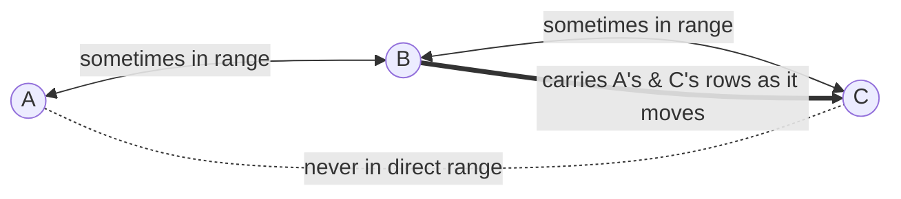
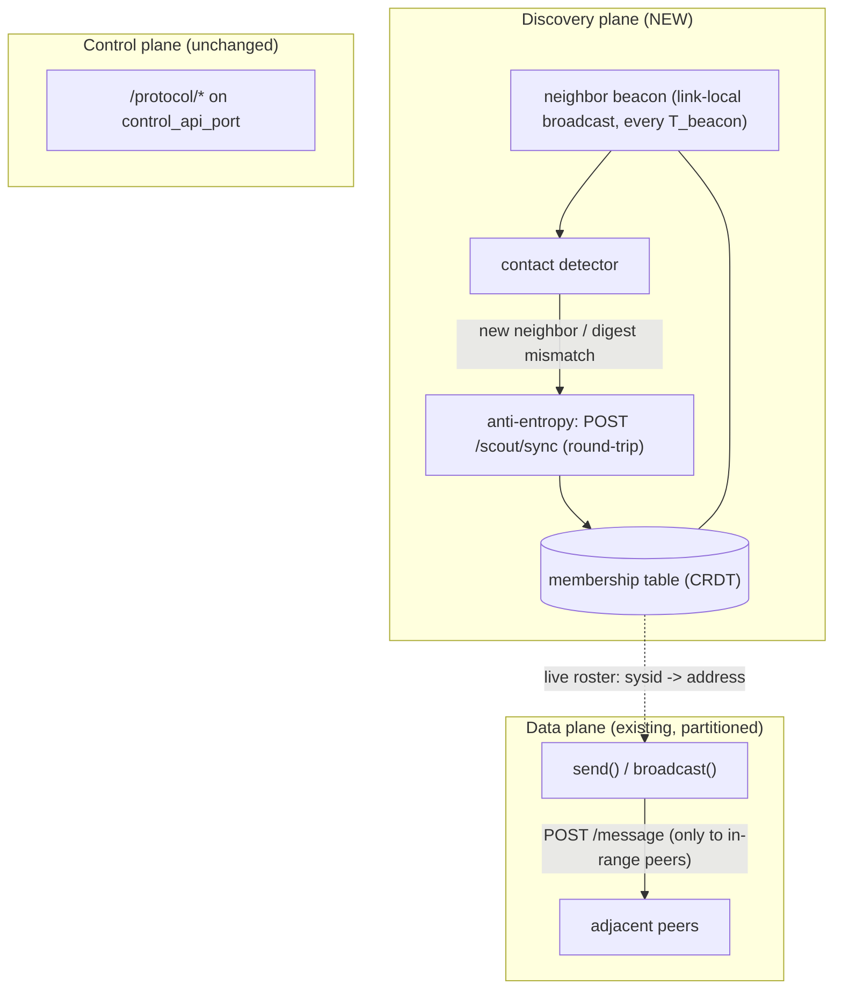
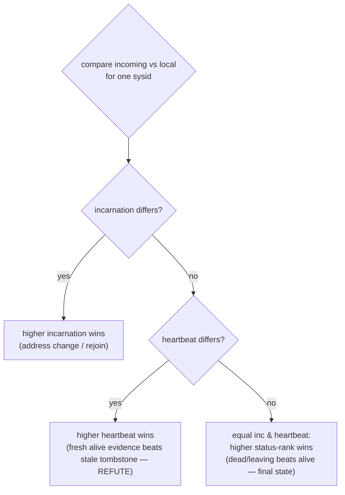
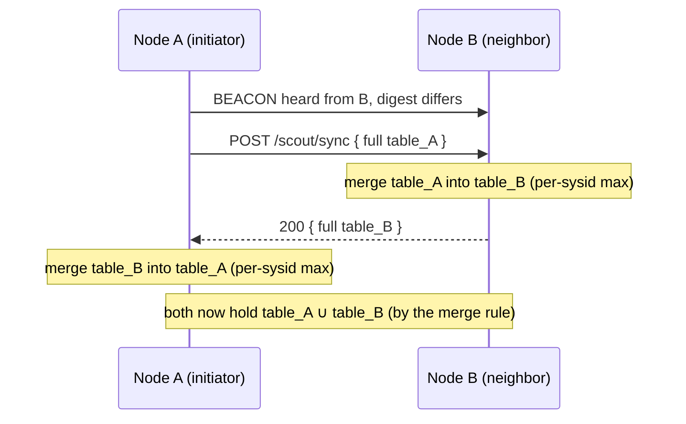
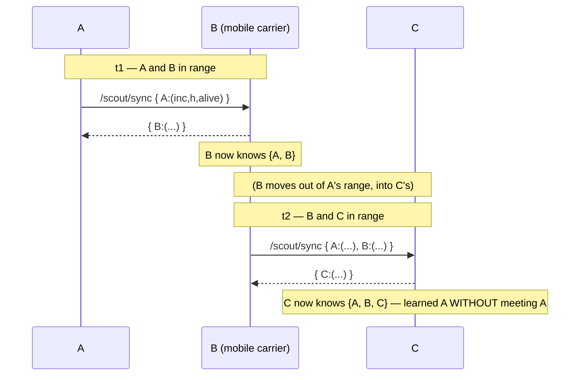
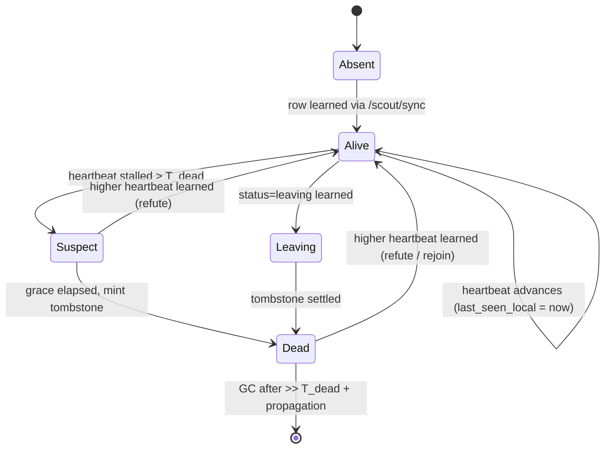

# A Contact-Triggered Anti-Entropy Auto-Scout Protocol

*Store-carry-forward membership discovery for a sparse, intermittently-connected GrADyS-Embedded fleet.*

This document specifies a third auto-scout design for the case the other two do not cover: a fleet whose
drones are **sparsely distributed**, so radio contact is **intermittent and not global** and **some pairs
of drones may never come into direct range of each other.** The mechanism lets a node learn the swarm
roster anyway, by **reconciling membership tables whenever two drones happen to meet** and letting the
knowledge **ride along on the moving drones** until it reaches everyone. There is **one table, one
beacon, and one reconciliation exchange**, merged by a rule that is immune to the order in which contacts
happen.

It belongs to a family — **delay/disruption-tolerant networking (DTN)** and **epidemic dissemination** —
and is a deliberate hybrid of the two earlier designs:

- [`http-auto-scout-epidemic-anti-entropy.md`](./http-auto-scout-epidemic-anti-entropy.md) — the **epidemic draft** (Solution 1):
  pairwise anti-entropy `SYNC` over a membership table, with a sync table, modes, and termination
  detection.
- [`http-auto-scout-soft-state-announce.md`](./http-auto-scout-soft-state-announce.md) — **soft-state self-announce**
  (Solution 2): periodic multicast beacons over a reliable, global multicast LAN.

This protocol **resurrects Solution 1's anti-entropy core** (the right primitive for carry-forward),
**fixes Solution 1's fatal pieces** (termination machinery, the SYNC stall, the refute problem), and
**keeps only Solution 2's beacon — as a neighbor detector, not as the membership layer.** **Part I** is
the standalone specification; **Part II** is the critique of Solutions 1 and 2 *in this scenario* that
motivates each choice.

---

# Part I — The solution

## 1. Scenario (motivation and envelope)

On the HTTP transports (`http` / `https` / `http3`), every node must be pre-loaded with a complete,
immutable `node_ip_dict`, and `auto_scout` is a no-op (`runner/configuration.py.__post_init__` only
warns). Solution 2 brought self-discovery to these transports by having each node multicast "I'm here" on
a fixed cadence — but it assumes **one reliable, global multicast domain** in which every node hears
every beacon directly. **This scenario denies exactly that assumption.**

| Assumption | Value | Consequence |
|---|---|---|
| Fleet size | 4–15 drones | Tables are tiny; ship them whole on contact. |
| Churn (rotativity) | Low | Death detection can be slow and conservative. |
| Connectivity | **Sparse, intermittent, not global** | No single broadcast domain; the reachability graph is time-varying and often partitioned. |
| Direct range | **Some pairs never meet** | Knowledge must travel **multi-hop, carried by moving drones**. |
| Transport | HTTP family | Data plane is the existing unicast `POST`; only *adjacent* nodes can talk at any instant. |

The network is therefore a **DTN**: connectivity is an intermittently-connected, time-varying graph, not
a mesh. The design goal is **eventual** global membership — every node eventually learns the full roster
*provided the network is eventually connected* (any two nodes are linked, directly or through a chain of
moving relays, infinitely often). §9 is honest about what happens when even that fails.

---

## 2. Network model: store-carry-forward

The core idea, borrowed from **epidemic routing** (Vahdat & Becker) and **anti-entropy** (Demers et al.):

> **A drone cannot reach everyone, but it can reach *someone*, and drones move. So knowledge is
> propagated by reconciling with whoever is in range now, and physically carried to the next contact.**

Three primitives, each its own section:

- **Neighbor beacon** (§5) — a link-local broadcast that answers *"who is in range right now?"*. Its only
  job is contact detection.
- **Contact-triggered reconciliation** (§6) — when a contact is detected, the two nodes exchange and
  merge their full membership tables in one idempotent round-trip.
- **Order-independent merge** (§4) — the merge rule is commutative and idempotent, so it does not matter
  in what order, or how many times, contacts happen. This is what makes carry-forward correct over an
  arbitrarily messy contact schedule.

There is no global broadcast, no convergence *predicate*, and no assumption that any particular pair of
nodes is ever simultaneously reachable.



A and C never meet; B learns A while near A, **carries** that knowledge, and hands it to C at a later
contact. C learns A without ever seeing A.

---

## 3. Three planes

The protocol adds a **discovery plane** beside the existing data and control planes. Note the data plane
is itself partitioned — a node can only `POST` to whoever is currently in range.



---

## 4. Data structure and the merge rule

One membership table. One row per known node, treated as a **CRDT last-writer-wins register** whose sole
writer is the node it describes:

| Field | Meaning | Scope |
|---|---|---|
| `sysid` | Unique node id (the value protocols use as `node_id`). | on the wire |
| `address` | Where to reach it for the data plane (`ip:port`). | on the wire |
| `incarnation` | Owner-minted counter, bumped on **address change / hard restart / deliberate rejoin**. | on the wire |
| `heartbeat` | Owner-minted **monotonic counter**, bumped every beacon. The **refutation key**. | on the wire |
| `status` | `alive` / `leaving` / `dead`. `leaving` and `dead` are tombstones. | on the wire |
| `last_seen_local` | Local monotonic time the observer last saw this row's `heartbeat` *advance*. | **local only** |

`heartbeat` is a **counter, not a clock** — deliberately, because the runner's `current_time()` is a
per-node monotonic clock with no cross-node synchronization (a documented hardware gotcha). Counters are
compared only against the *same node's* prior counter, so no global time is ever needed.

**Merge / arbitration.** When two views of the same `sysid` meet, keep the one with the larger
**(incarnation, heartbeat, status-rank)**, compared lexicographically, with:

```
status-rank:  alive = 0  <  leaving = 1  <  dead = 2
```



This single rule does three jobs:

1. **Address change / rejoin** — the owner bumps `incarnation`; the new row dominates.
2. **Refutation of a false death** — a node wrongly tombstoned while merely out of range keeps bumping
   its `heartbeat`; its `(inc, H+k, alive)` row beats the stale tombstone `(inc, H, dead)` by heartbeat,
   **without the owner needing to know it was suspected.** This is the partition-tolerant generalization
   of SWIM's incarnation-refute, and it is why this design has no unsolved refute problem.
3. **Confirmed death** — a truly dead node's last heartbeat `H` is never exceeded, so a detector's
   tombstone `(inc, H, dead)` (minted at the **last-seen** `(incarnation, heartbeat)`) wins everywhere.
   **No "version above the last seen" ever has to be invented** — dissolving Solution 1's §10 open
   problem.

Because the rule is a per-`sysid` max over a totally-ordered key, it is **commutative, associative, and
idempotent** — merging in any order, any number of times, converges to the same table. That is exactly
the property a chaotic contact schedule demands.

---

## 5. The neighbor beacon (contact detection only)

Every `T_beacon` (≈1–2 s) a node broadcasts a tiny datagram on the **link-local** segment — the set of
nodes currently in radio range:

```
BEACON  { sysid, address, table_digest }      → link-local broadcast
```

`table_digest` is a cheap summary of the sender's table (a monotonic table-generation counter, or a hash
of `{sysid: (incarnation, heartbeat, status)}`). On hearing a `BEACON` from neighbor **N**, a node
triggers reconciliation (§6) **only if**:

- N is **newly in range** (not heard from recently), **or**
- N's `table_digest` **differs** from the digest at our last successful reconciliation with N.

Otherwise it does nothing — two in-range nodes that already agree fall silent (no wasteful re-syncing),
so the protocol is **quiescent when neighbors are converged** and active only when there is genuinely
something to exchange.

**The beacon's only role is contact detection.** Unlike Solution 2, it is *not* the membership mechanism:
a beacon names just the sender, reaches only the current radio neighborhood, and never carries the
roster. Membership travels through §6.

---

## 6. Contact-triggered anti-entropy

When a contact is detected, the two nodes reconcile their **full** tables in one idempotent round-trip
over the data plane:



Properties:

- **One round-trip = full bidirectional reconciliation.** A learns everything B knows (including nodes A
  has never met) and vice-versa.
- **Idempotent.** Re-merging the same table is a no-op under the max rule, so any leg may be retried
  freely. A lost response simply leaves A un-updated until the **next** contact — no special recovery.
- **No shared post-condition.** There is no sync table, no `Normal`/`Syncing` mode, and no "mark each
  other synced" mutual flag. Each side independently merges what it received. The asymmetric-failure
  **stall that Solution 1 flags in its §9 cannot arise**, because there is no two-node agreement to
  desynchronize — only two independent local merges.
- **Full table each contact.** At ≤15 small rows this is trivial. A digest/diff exchange (ship only rows
  the peer lacks or has staler) is the obvious escape hatch *if* tables ever grow large — noted, not
  built (see §11).

This is precisely the "**synchronous, idempotent, full-table request/response**" that Solution 1's own
§9 recommends as its baseline ("Direction 1") — adopted here and stripped of the surrounding sync-table
superstructure that this scenario makes unworkable (Part II).

`POST /scout/sync` is a **request/response** endpoint — note it is *not* fire-and-forget like
`/message`. It is exchanged only between **currently-in-range** neighbors, so the round-trip is local and
short-lived.

---

## 7. A carried-forward worked example

A, B, C; A and C are **never** simultaneously in range. B ferries knowledge between them.



Table view per node (`+X` = row for X present), where each contact is a separate point in time:

| After | A knows | B knows | C knows |
|---|---|---|---|
| 0 — initial | `{A}` | `{B}` | `{C}` |
| t1 — A↔B sync | `{A, B}` | `{A, B}` | `{C}` |
| t2 — B↔C sync | `{A, B}` | `{A, B, C}` | **`{A, B, C}`** |
| t3 — A↔B again (later) | **`{A, B, C}`** | `{A, B, C}` | `{A, B, C}` |

Convergence is paced by the **contact schedule**, not by a network diameter or a beacon interval: the
roster is exactly as fresh as the last relevant chain of meetings. There is no "converged" flag to
compute — the table is monotonically more complete with every contact and is correct (by the merge rule)
at every intermediate step.

---

## 8. Liveness: explicit leave, slow conservative death

Under partition, **local silence cannot mean death** — a node may simply be out of range for minutes.
Detection is therefore deliberately conservative, biased hard against false positives.

- **Graceful leave (primary removal).** A departing node bumps its `incarnation` and announces
  `status=leaving`; the tombstone propagates by anti-entropy (§6) exactly like any other row. This is the
  clean, fast path and the one to rely on.
- **Crash (slow fallback).** An observer marks a node `suspect` only after its `heartbeat` has **failed
  to advance — via any sync path — for a large, conservative `T_dead`** (e.g. minutes; chosen ≫ the
  expected partition duration), measured on the observer's own monotonic clock against its own
  `last_seen_local`. After a further grace it mints a tombstone at the last-seen `(incarnation,
  heartbeat)`.
- **Self-healing false death.** Because `T_dead` is large and the merge rule lets fresh `heartbeat`
  evidence beat a stale tombstone, a wrongly-tombstoned node is **resurrected automatically** on its next
  contact (§4, job 2). False death is transient, never permanent.
- **Tombstone GC.** Tombstones may be dropped after `≫ T_dead + max expected propagation`, safely: a
  returning node re-adds itself via a higher `heartbeat` whether or not the tombstone still exists.

The full lifecycle of **one row** in an observer's table:



We deliberately do **not** adopt SWIM's indirect probing (asking *k* relays to ping a suspect): at 4–15
nodes a single conservative timeout is enough, and indirect probing across a partitioned graph would be
both complex and unreliable — over-engineering for this envelope.

---

## 9. Inherent limits (stated honestly)

These are properties of the *scenario*, not defects of the protocol — no auto-scout layer can escape
them:

1. **Eventual connectivity is required for global membership.** If the network is **not
   eventually-connected** — some node shares *no* contact path with the rest within any timeout —
   complete membership is impossible. The protocol degrades **gracefully** to **per-partition
   membership**: each connected component converges internally, and the components reconcile the moment
   any two of their members meet.
2. **Membership ≠ reachability.** The roster is *eventually* global, but *live reachability* is not. A
   node may know B exists yet be unable to `POST` to B right now. `send()` to an out-of-range member
   fails (fire-and-forget already tolerates this — a documented gotcha); `broadcast()` reaches only
   current neighbors.
3. **This protocol propagates *membership*, not application data.** Multi-hop *data* delivery — true DTN
   bundle routing (PRoPHET, Spray-and-Wait, etc.) — is **out of scope**. Carrying the roster forward is
   cheap and bounded; carrying arbitrary application traffic is a different, much larger problem and
   would be over-engineering to fold in here.

---

## 10. Integration with the runtime

The same seam as the other two solutions, with discovery-specific additions:

- **Membership table → runtime directory.** When `auto_scout=True`, `HttpBackend.send(dest_node_id)`
  resolves against the table and `broadcast()` iterates its live (non-tombstoned) rows
  (`communication/http.py`). With `auto_scout=False`, behavior is exactly today's static `node_ip_dict`.
- **New `/scout/sync` endpoint** for the §6 round-trip — a small request/response handler (its own scout
  app, or mounted beside `/message`). Unlike `/message` it is **not** fire-and-forget.
- **Link-local beacon socket** — a UDP broadcast/multicast socket scoped to the local segment, separate
  from the data plane; reuses the beacon machinery introduced for Solution 2 but in the
  contact-detection role.
- **Honor `auto_scout` for the HTTP family** — flip the `runner/configuration.py.__post_init__` warning
  so `auto_scout=True` is accepted, not ignored.
- **Caveat to document loudly in code:** the table gives the *roster*, not *current reachability* (§9.2).

No change to the `CommunicationBackend` ABC or to protocol code; the addition is additive and flag-gated.

---

## 11. Parameters and defaults

| Parameter | Default | Meaning / guidance |
|---|---|---|
| `T_beacon` | `1.0 s` | Link-local beacon period = contact-detection latency. |
| `T_dead` | **conservative, e.g. `120 s`** | Heartbeat-stall window before `suspect`. Must exceed the longest *normal* partition; bias high. |
| death grace | `≈ T_dead` | Extra wait `suspect → dead` before minting a tombstone. |
| tombstone GC | `≫ T_dead + max propagation` | When to forget a tombstone (safe — resurrection is heartbeat-driven). |
| sync mode | full table | Switch to digest/diff only if rows ever exceed ~hundreds (not this envelope). |

Steady-state cost is one tiny beacon per `T_beacon` per node on the local segment, plus a single
short round-trip per *changed* contact — near zero when the fleet is converged and stationary.

---

# Part II — Critique of the existing solutions in this scenario

This part evaluates Solutions 1 and 2 **specifically under sparse, intermittent connectivity**, and shows
why this design borrows from each.

## 12. Solution 1 (epidemic draft) — right family, wrong triggering and termination

**Vindicated.** Solution 1's pairwise `SYNC` anti-entropy over a membership table is *exactly* the
carry-forward primitive a DTN needs. The very mechanism Solution 2 discarded as "over-engineered for a
full-mesh LAN" is **required** here — there is no other way to get a row from A to a C that A never meets.
Solution 1 also already has the right arbitration spine (per-`sysid` incarnation, highest-wins), which
this design extends with `heartbeat`.

**But its specific machinery fails under partition:**

- **Event-triggered, not contact-triggered.** Solution 1 reacts to *membership changes* ("learn
  something new → mark all peers `unsynced` → `SYNC` them"). That assumes the peers are *reachable*. Here
  most peers are out of range at any instant, so the trigger fires against nodes it cannot reach. The
  correct trigger is **physical contact** — reconcile with whoever is in range now (§5–§6).
- **Termination never terminates.** Solution 1's convergence/quiescence rests on every sync-table row
  reaching `synced`, at which point a node drops to `Normal`. Under chronic partition, out-of-range peers
  stay **perpetually `unsynced`**, pinning every node in `Syncing` forever, endlessly retrying
  unreachable addresses. The all-`synced` termination signal — the whole point of the sync table — is
  **meaningless when the graph is never fully connected**. This design therefore **deletes the sync
  table, the modes, and termination detection** outright (there is nothing to terminate; §6).
- **The §9 SYNC stall** is latent here too; it is removed by the idempotent two-merge round-trip (§6),
  which is Solution 1's own recommended baseline minus the mutual-flag bookkeeping.
- **`NOTIFY` multicast assumes one domain** and cannot cross a partition; it is replaced by the
  link-local beacon (§5) plus carry-forward.
- **The §10 tombstone/refute problem is unsolved** in Solution 1; here it dissolves because `heartbeat`
  supplies a natural, owner-authoritative refutation and tombstones are minted at the last-seen counter
  (§4, §8).

*Net: keep Solution 1's table + anti-entropy; make it contact-triggered, drop the termination
superstructure, add `heartbeat`-keyed CRDT merge, and use the idempotent exchange.*

## 13. Solution 2 (soft-state self-announce) — inadequate here, but one reusable part

**Fatally mismatched to this scenario:**

- **Direct-broadcast only — no transitive propagation.** Solution 2 has each node multicast its *own* row
  and nothing else. Two nodes that never share range **never learn about each other** — there is no
  relay, no carry-forward. It is a **neighbor table, not a membership table.**
- **`K·T` timeout expiry is catastrophic under partition.** Solution 2 drops any node not heard from in a
  few seconds. When partition is *normal*, that collapses the table to *current direct neighbors only* —
  the opposite of what a sparse fleet needs.

**The one reusable part:** Solution 2's **link-local beacon is an excellent contact detector.** This
design keeps it (§5) but **repurposes** it — to *trigger* anti-entropy rather than to *be* the membership
layer — and replaces soft-state timeout expiry with conservative `heartbeat`-based liveness (§8).

*Net: Solution 2's central assumption (reliable, global multicast) is precisely what this scenario
denies; its mechanism degrades to neighbor discovery, which is all we borrow.*

## 14. Mapping to known systems

| Mechanism used here | Established source | Role |
|---|---|---|
| Store-carry-forward on contact | Epidemic routing (Vahdat & Becker, 2000) | Core propagation model (§2) |
| Push-pull reconciliation on contact | Anti-entropy (Demers et al., 1987) | The `/scout/sync` exchange (§6) |
| Order-independent merge | CRDT LWW-register (Shapiro et al., 2011) | Per-`sysid` table merge (§4) |
| Owner-authoritative refutation | SWIM incarnation (Das et al., 2002) | Generalized to `heartbeat` for partition tolerance (§4, §8) |
| Intermittent time-varying graph | DTN store-carry-forward (Fall, 2003) | The network model (§1–§2) |
| Transitive peer discovery | Zenoh gossip scouting | Cousin — but assumes a *connected* graph, not chronic partition |
| **Deliberately *not* used** — PRoPHET / Spray-and-Wait (data routing), vector clocks (causal histories), Merkle anti-entropy (large-scale digests) | — | Out of scope; would over-engineer this envelope (§9.3, §11) |

## 15. When this design is the wrong one

To keep the three solutions honestly bounded:

- **Dense, reliably-connected LAN** → use **Solution 2** (soft-state self-announce). Contact-triggered
  anti-entropy is needless overhead when every node hears every beacon directly.
- **Large *and* connected** (hundreds of nodes, but well-connected) → **Solution 1 / Serf-style**
  epidemic gossip with proper termination, or just **Zenoh** (`zenoh_*` + `auto_scout=True`), pays off.
- **This design earns its keep only when connectivity is genuinely sparse and intermittent** — when
  carry-forward across moving relays is the *only* way a row reaches a distant node. Outside that
  envelope its machinery (beacon + `/scout/sync` + heartbeat liveness) is more than the situation needs.

## 16. Summary

For a sparse, intermittently-connected fleet of 4–15 drones with low churn, **contact-triggered
anti-entropy** delivers eventual global membership the only way the topology allows: reconcile with
whoever you meet, merge by an order-independent rule, and let moving drones carry knowledge across the
gaps. It keeps the best of both prior designs — Solution 1's anti-entropy table and Solution 2's beacon —
while discarding the parts each gets wrong here (Solution 1's termination machinery, Solution 2's
direct-only broadcast and aggressive expiry). It resolves the open problems of the epidemic draft
(`heartbeat`-keyed refutation, no invented tombstone versions, no stall) and is honest about the one
thing no protocol can fix: where the network is never eventually-connected, membership is per-partition,
and knowing a node exists is not the same as being able to reach it.

---

## 17. Bibliography

The established work this design builds on (the formal companion to the §14 mapping table):

- **Epidemic Routing** — A. Vahdat, D. Becker, "Epidemic Routing for Partially-Connected Ad Hoc Networks",
  Tech. Report CS-2000-06, Duke University, 2000.
  [issg.cs.duke.edu/epidemic/epidemic.pdf](http://issg.cs.duke.edu/epidemic/epidemic.pdf). — the
  store-carry-forward dissemination model in intermittently-connected networks (§2).
- **Anti-entropy / epidemic gossip** — A. Demers et al., "Epidemic Algorithms for Replicated Database
  Maintenance", *Proc. PODC '87*, pp. 1–12, 1987.
  DOI: [10.1145/41840.41841](https://doi.org/10.1145/41840.41841). — the push-pull reconciliation the
  contact-triggered `/scout/sync` exchange performs (§6).
- **CRDTs** — M. Shapiro, N. Preguiça, C. Baquero, M. Zawirski, "Conflict-free Replicated Data Types",
  *SSS 2011*, LNCS 6976, Springer, pp. 386–400, 2011.
  DOI: [10.1007/978-3-642-24550-3_29](https://doi.org/10.1007/978-3-642-24550-3_29); tech-report:
  [INRIA RR-7506](https://inria.hal.science/inria-00555588), 2011. — the LWW-register, commutative and
  idempotent, that makes the per-`sysid` merge order-independent (§4).
- **SWIM** — A. Das, I. Gupta, A. Motivala, "SWIM: Scalable Weakly-consistent Infection-style Process
  Group Membership Protocol", *Proc. DSN '02*, IEEE/IFIP, pp. 303–312, 2002.
  DOI: [10.1109/DSN.2002.1028914](https://doi.org/10.1109/DSN.2002.1028914). — the incarnation/refute
  mechanism, here generalized to a `heartbeat` counter for partition tolerance (§4, §8).
- **DTN architecture** — K. Fall, "A Delay-Tolerant Network Architecture for Challenged Internets",
  *Proc. SIGCOMM '03*, pp. 27–34, 2003.
  DOI: [10.1145/863955.863960](https://doi.org/10.1145/863955.863960); companion: V. Cerf et al.,
  "Delay-Tolerant Networking Architecture", IETF [RFC 4838](https://www.rfc-editor.org/rfc/rfc4838), 2007.
  — the store-carry-forward network model and intermittent-connectivity framing (§1–§2).
- **Eclipse Zenoh** — Eclipse Foundation / ZettaScale, "Zenoh" — scouting (UDP multicast `224.0.0.224:7446`
  + gossip) peer discovery (open-source), 2017–present.
  [zenoh.io](https://zenoh.io/docs/getting-started/deployment/)
  ([github.com/eclipse-zenoh/zenoh](https://github.com/eclipse-zenoh/zenoh)). — the transitive-discovery
  cousin already wired to `auto_scout` in this codebase, which assumes a connected (not chronically
  partitioned) graph (§14).
