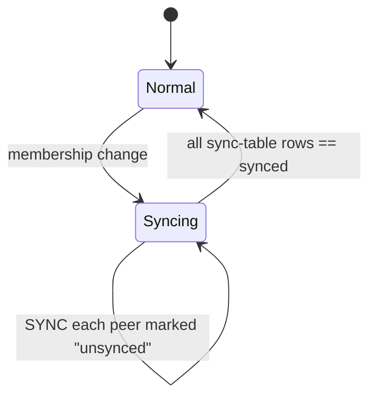
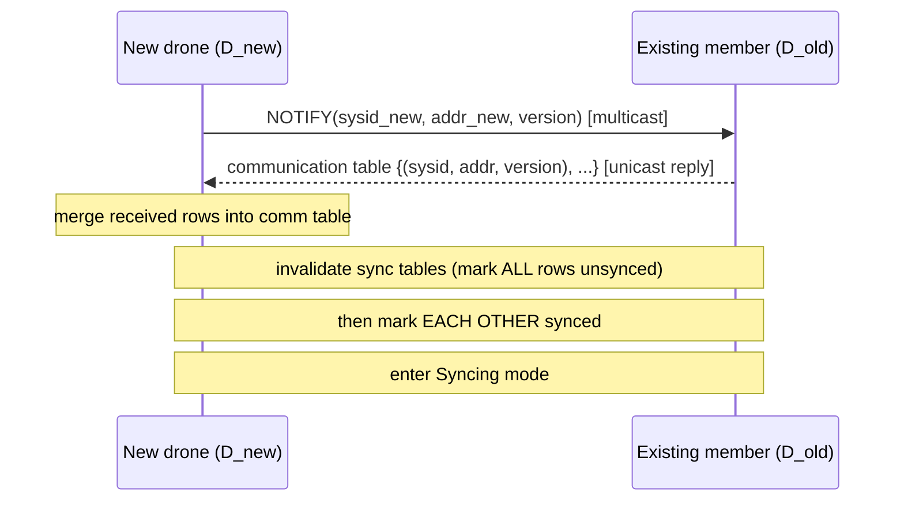
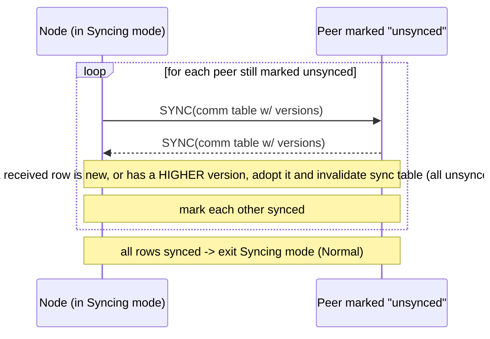
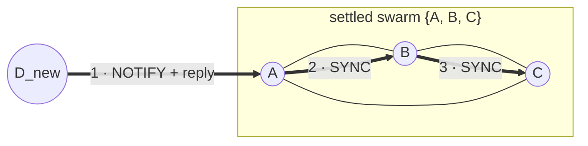

# An HTTP Auto-Scout Protocol

*Application-level, gossip-based membership discovery for the GrADyS-Embedded HTTP transport.*

This document drafts a protocol that lets a drone **join a swarm by announcing itself**, with no
pre-shared peer list. Each node maintains a small **membership table** of `(sysid, address)` entries
and reconciles it pairwise with other nodes whenever it changes. A join (or a departure) is a local
perturbation that **propagates epidemically** through these pairwise reconciliations until every node
has converged on the same view of the swarm. The mechanism is built from **two tables**, **three
messages**, and **two modes**.

---

## 1. Motivation

On the GrADyS-Embedded HTTP transports (`http` / `https` / `http3`), every node must be pre-loaded
with a complete and immutable peer directory — a `node_ip_dict` mapping each `sysid` to an `ip:port`
address. Adding or moving a drone means editing that directory on **every** node before launch.

The zenoh transports avoid this: they get peer discovery "for free" from Eclipse Zenoh's built-in UDP
multicast scouting. The HTTP transports have no equivalent — `auto_scout` is currently a no-op for
them.

The goal of this protocol is to bring **self-discovery to the HTTP transport** as an application-level
layer: a new drone announces itself on the LAN, learns who else is in the swarm, and the swarm learns
about it — all at runtime, without a hand-maintained peer list.

---

## Scenario

This protocol targets the **broadest envelope** of the three auto-scout designs — it makes the fewest
assumptions about fleet size or topology and pays for that generality with the most machinery.

| Assumption | Value | Consequence |
|---|---|---|
| Fleet size | Small to large — **no fixed ceiling** | Transitive, epidemic propagation earns its keep as the node count grows beyond cheap full-mesh contact. |
| Churn (rotativity) | Any — convergence absorbs it | Membership re-settles after every join/leave via pairwise reconciliation; the all-`synced` signal detects quiescence. |
| Network | Multicast-capable LAN, with pairwise unicast reachability | `NOTIFY` announces a join to the group; `SYNC` reconciles tables pairwise. |
| Direct range | Every node reachable directly **or transitively** | A relay node carries news the announcer cannot reach directly — the defining capability of an epidemic scheme. |
| Transport | HTTP family (`http` / `https` / `http3`) | Discovery is an application-level layer; the unicast `POST /message` data plane is unchanged. |

**Network model.** A single, well-connected broadcast-plus-unicast domain in which any node can reach
any other directly or through a chain of healthy relays. Membership changes are **local perturbations**
that diffuse epidemically until every node converges on the same roster. This is deliberately the most
general model: the two sibling documents specialize it — `http-auto-scout-soft-state-announce.md` to a
small full-mesh LAN where transitive relay is unnecessary, and `http-auto-scout-contact-triggered-dtn.md`
to a sparse, intermittently-connected fleet where it is mandatory.

---

## 2. Approach overview

The protocol is an **anti-entropy / epidemic gossip** scheme over a membership table. The key ideas:

- Each node owns a **communication table** (who is in the swarm) and a **sync table** (which peers
  have already seen my current view).
- A **join** is announced once by multicast (`NOTIFY`) and then reconciled pairwise (`SYNC`).
- Whenever a node learns something new, it flags *all* peers as needing a re-sync. This is what makes
  news travel transitively across the whole swarm.
- The swarm **converges**: once membership stops changing, every node's sync table becomes
  all-`synced` and the gossip quiesces.

Two tables, three messages (`NOTIFY`, `SYNC`, `LEAVE`), two modes (`Normal`, `Syncing`).

---

## 3. Data structures

### Communication table

One row per known swarm member:

| Field | Meaning |
|---|---|
| `sysid` | The member's unique identifier. |
| `address` | Where to reach it (`ip:port`). |
| `version` | A **monotonic counter owned by the row's `sysid`** — an *incarnation number*. |

The `version` is the **arbitration key**. A node increments *its own* version whenever its address
changes. For any given `sysid`, the row with the **highest version wins**, deterministically — and
because exactly one node is authoritative for each row, there is never an unresolvable tie.

### Sync table

Exactly **one row per communication-table row**, flagging each peer as `synced` or `unsynced`
*relative to this node* — i.e. "has this peer already seen my current membership view?"

```
Communication table                       Sync table
| sysid | address       | version |       | sysid | synced |
|-------|---------------|---------|       |-------|--------|
|   1   | 10.0.0.1:5000 |    3    |       |   1   |  yes   |
|   2   | 10.0.0.2:5000 |    1    |       |   2   |  no    |   <- still needs a SYNC
```

When a node learns anything new, it **invalidates** its sync table — marks every row `unsynced` — so
that the new information is pushed out to everyone.

---

## 4. Messages

### NOTIFY — multicast

A joining drone announces its own `(sysid, address, version)` to the LAN multicast group. It is the
"I'm here" signal; only a *new* node sends it.

### SYNC — unicast, request/response

Two nodes exchange their **full communication tables** (rows carry their versions). Unlike a
fire-and-forget message, a `SYNC` expects a reply — it is a two-way reconciliation.

**Row arbitration on receipt** — for each received row, keyed by `sysid`:

| Situation | Action | Counts as "new/changed"? |
|---|---|---|
| `sysid` unknown locally | Add the row. | **Yes** |
| `sysid` known, received `version` **>** local | Adopt the new address + version. | **Yes** |
| `sysid` known, received `version` **≤** local | Ignore (stale). | No |

A row that counts as "new/changed" triggers a **sync-table invalidation** (mark all `unsynced`), so
the freshly-learned information continues to propagate.

### LEAVE — multicast

A drone that is leaving the swarm gracefully announces its own `(sysid, version)` to the multicast
group with a version *higher* than its last live one. Receivers **tombstone** that row (rather than
plainly deleting it) and invalidate their sync tables, so the removal propagates through `SYNC` with
the same highest-version-wins rule that governs joins. `LEAVE` is the mirror image of `NOTIFY`: where
`NOTIFY` adds a member, `LEAVE` retires one. (Crash-induced removals reuse the same tombstone
mechanism without an explicit `LEAVE` — see §8.)

---

## 5. Modes

A node is in `Normal` mode when its view is settled, and in `Syncing` mode while it still has peers to
reconcile with.



---

## 6. Join procedure

1. The new drone **multicasts `NOTIFY`** with its own `(sysid, address, version)`.
2. An existing member **replies (unicast)** with its full communication table.
3. The new drone **merges** the received rows into its communication table.
4. **Both** nodes **invalidate** their sync tables (all rows `unsynced`), then **mark each other
   `synced`** — they have just reconciled directly, so they don't need to re-sync with one another.
5. Both **enter `Syncing` mode** and begin sending `SYNC` to every peer still marked `unsynced`.
6. When a node's sync table is **all `synced`**, it returns to `Normal`.

The join unfolds in two phases, each with its own diagram below: the **`NOTIFY` announcement**
(steps 1–4) and the **`SYNC` reconciliation** (steps 5–6).

### Phase 1 — `NOTIFY` (announcement)

The new drone announces itself, receives a peer's table, merges it, and both ends mark each other
`synced` before entering `Syncing` mode.



### Phase 2 — `SYNC` (reconciliation)

Now in `Syncing` mode, the node reconciles with every peer still marked `unsynced`. This phase is what
carries the change across the **whole swarm**, so it is drawn generically — a node and any peer it has
marked `unsynced`, not just the joining pair.



**Departure (`LEAVE`) follows the same shape as `NOTIFY`.** A departing drone multicasts `LEAVE`
instead of `NOTIFY`; receivers **tombstone** the row (rather than adding one) and invalidate their
sync tables before entering `Syncing` mode. From there the `SYNC` phase above is identical — only the
seed event differs (retire a member vs. add one) — so `LEAVE` reuses both diagrams rather than needing
its own. See §8 for tombstone/version details.

---

## 7. Propagation & convergence (worked example)

Start with a settled swarm of three nodes — **A**, **B**, **C** — all in `Normal` mode with identical
communication tables `{A, B, C}` and all-`synced` sync tables. A new node **D** joins via **A**. The
news of D then ripples outward through `SYNC`:



**Step 1 — D announces, A responds.** D multicasts `NOTIFY(D)`; A replies with `{A, B, C}`; D merges
→ `{A, B, C, D}`. Both invalidate their sync tables and mark *each other* `synced`, entering `Syncing`.

**Step 2 — A reconciles outward.** A `SYNC`s B. B sees the **new row D**, adds it, and **invalidates
its own sync table**; A and B mark each other `synced`. B is now `Syncing` too.

**Step 3 — the wave continues.** B `SYNC`s C; C learns D, invalidates, and re-syncs its neighbours.
Any exchange where *nothing new* is learned simply flips the pair to `synced` without re-invalidating.

**Step 4 — quiescence.** Once every node holds `{A, B, C, D}` and no `SYNC` reveals an unknown or
higher-version row, every sync table reaches all-`synced` and each node returns to `Normal`.

Each node's view (`+D` = row for D present) and mode evolve as follows (**bold** = changed this step):

| After step | A | B | C | D |
|---|---|---|---|---|
| 0 — initial | `{A,B,C}` · Normal | `{A,B,C}` · Normal | `{A,B,C}` · Normal | *not joined* |
| 1 — NOTIFY (D ↔ A) | **`+D`** · **Syncing** | `{A,B,C}` · Normal | `{A,B,C}` · Normal | **`{A,B,C,D}`** · **Syncing** |
| 2 — SYNC A → B | `+D` · Syncing | **`+D`** · **Syncing** | `{A,B,C}` · Normal | `+D` · Syncing |
| 3 — SYNC B → C | `+D` · Syncing | `+D` · Syncing | **`+D`** · **Syncing** | `+D` · Syncing |
| 4 — quiescence | `+D` · **Normal** | `+D` · **Normal** | `+D` · **Normal** | `+D` · **Normal** |

The take-away: a single join triggers a **transitive, epidemic** spread, and the all-`synced`
condition is a natural, local **termination signal**.

---

## 8. Node departure & failure handling

Departures are handled with the **same two-table / highest-version machinery** as joins — they are
first-class, not an afterthought.

- **Graceful leave.** A leaving drone sends the `LEAVE` message (§4). Peers tombstone the row and
  invalidate their sync tables; the removal then propagates through `SYNC` exactly like a join.
- **Crash / silent failure.** `SYNC` doubles as a liveness probe. Repeated `SYNC` failures against a
  peer mark it dead → its row is **tombstoned** → the tombstone propagates via the same `SYNC`
  reconciliation. (No `LEAVE` is sent — the failed node is gone — so the tombstone version is minted
  by the detector instead; see the open subtlety below.)
- **Tombstones reuse the row version.** A plain delete can be "resurrected" by a peer that still holds
  the live row. So a removal is modelled as a **tombstone carrying a version *higher* than the last
  live version** for that `sysid`; the same highest-version-wins rule then makes the removal beat any
  stale "alive" row.
  - *Open subtlety:* a crashed node cannot bump its own version, so a failure detector must mint a
    tombstone version above the last seen — the classic SWIM "refute" problem. Flagged in §10, not
    solved here.

---

## 9. SYNC transport semantics

Every other message in this protocol tolerates loss: the HTTP data plane (`/message`) is
**fire-and-forget** — sends are scheduled and never confirmed, and the protocol assumes unreliable
delivery. `SYNC` is the exception. It is a **two-way exchange with a shared post-condition**: both
peers must receive each other's table, and *both* must finish marking each other `synced`. That
mutual bookkeeping is what makes the transport hard.

**Why it's subtle:**

- **Asymmetric failure → state divergence.** If A's table reaches B but B's reply is lost, B marks A
  `synced` while A still has B `unsynced`. The two now disagree about whether the exchange completed.
  The dangerous consequence: a node can reach all-`synced`, drop to `Normal`, and stop propagating
  while a peer still lists it `unsynced` — **stalling the epidemic and breaking the
  convergence/termination invariant** of §5–§7.
- **No two-phase commit.** "Mark each other synced" reads as atomic, but across two nodes one side
  inevitably commits before the other confirms; the protocol must tolerate that window.
- **Idempotency is mandatory.** Any leg may be retried, so re-processing the same table must be a
  no-op. Version arbitration (§4) already supplies most of this — re-received rows with ≤ versions are
  ignored and re-marking `synced` is idempotent — but only if the design leans on it deliberately.
- **Retry policy doubles as the failure detector.** §8 declares a peer dead after repeated `SYNC`
  failures, so the `SYNC` timeout/retry budget *is* the liveness detector — its threshold trades
  convergence speed against false-positive death declarations (tombstoning a slow-but-alive peer).
- **Concurrent SYNCs.** A SYNCs B while B SYNCs A simultaneously — two in-flight exchanges that can
  double-process and race on the mutual flags.

**Possible directions** (sketches, not a decision):

1. **Synchronous request/response RPC (full-table, idempotent).** A `POST`s its table to B's `/sync`;
   B processes it, marks A `synced`, and returns its own table in the response body, which A then
   processes. One round-trip = the full exchange. Natural HTTP fit and simplest to build; a lost
   *response* leaves A unmarked but is **self-healing via retry + idempotency**. Ships the whole table
   each time (wasteful only at scale). *Recommended baseline.*
2. **Two crossing one-way pushes + ACK (stay fire-and-forget).** SYNC becomes two independent one-way
   messages, each side marking the other `synced` on an explicit (or implicit reciprocal) ACK. Closest
   to the existing infrastructure, but splits one exchange into ≥2 messages, needs a sync-session id,
   and yields eventually-consistent (not per-exchange) flag agreement with a more complex state
   machine.
3. **Generation-keyed RPC with digests/diffs.** Like (1) but SYNC ships a per-row version
   vector/digest and the peer replies only with missing/stale rows; the `synced` flag is keyed to a
   monotonic table *generation*, so a lost response or concurrent change auto-invalidates it.
   Strongest against divergence and bandwidth-efficient under churn, but the most complex — likely
   over-engineered for a handful of drones, worthwhile for large/churny swarms.

---

## 10. Design considerations & open questions

Points worth discussing — not yet decided:

- **Tombstone versioning for crashes.** The address-change case is cleanly resolved by per-row
  versions (each `sysid` owns its own monotonic counter). The hard residue is choosing a tombstone
  version for a node that crashed *before* incrementing its own version — the failure detector must
  pick a value above the last seen (SWIM "refute").
- **Convergence under churn.** Liveness rests on membership eventually settling: sync tables reach
  all-`synced` only once changes stop. Continuous churn keeps invalidating tables and delays
  termination — worth bounding or characterising.
- **Concurrent joins.** Two drones joining at once produce interleaved invalidations; gossip still
  converges, but the interleaving deserves an explicit argument.
- **Multicast availability.** `NOTIFY` assumes a multicast-capable LAN (the same constraint zenoh's
  `auto_scout` already carries). On multicast-blocked networks, a seed / bootstrap node could stand
  in for the multicast announcement.

---

## Bibliography

The known distributed-systems work this design draws on:

- **Anti-entropy / epidemic gossip** — A. Demers, D. Greene, C. Hauser, W. Irish, J. Larson, S. Shenker,
  H. Sturgis, D. Swinehart, D. Terry, "Epidemic Algorithms for Replicated Database Maintenance",
  *Proc. PODC '87*, pp. 1–12, 1987. DOI: [10.1145/41840.41841](https://doi.org/10.1145/41840.41841)
  (repr. ACM SIGOPS OSR 22(1):8–32, 1988). — the push-pull anti-entropy and rumor-mongering model behind
  the `SYNC` reconciliation and its transitive propagation (§4, §7).
- **SWIM** — A. Das, I. Gupta, A. Motivala, "SWIM: Scalable Weakly-consistent Infection-style Process
  Group Membership Protocol", *Proc. DSN '02*, IEEE/IFIP, pp. 303–312, 2002.
  DOI: [10.1109/DSN.2002.1028914](https://doi.org/10.1109/DSN.2002.1028914). — source of the per-`sysid`
  incarnation numbers (§3) and of the "refute" problem this draft flags as open for crash-minted
  tombstones (§8, §10).
- **CRDTs** — M. Shapiro, N. Preguiça, C. Baquero, M. Zawirski, "Conflict-free Replicated Data Types",
  *SSS 2011*, LNCS 6976, Springer, pp. 386–400, 2011.
  DOI: [10.1007/978-3-642-24550-3_29](https://doi.org/10.1007/978-3-642-24550-3_29); tech-report:
  [INRIA RR-7506](https://inria.hal.science/inria-00555588), 2011. — the LWW-element-set / highest-version-wins
  merge that the communication table's version arbitration implements (§3, §4).
- **mDNS** — S. Cheshire, M. Krochmal (Apple), "Multicast DNS", IETF
  [RFC 6762](https://www.rfc-editor.org/rfc/rfc6762.html), 2013. — the multicast self-announcement pattern
  the `NOTIFY` join message mirrors (§4).
- **Serf / memberlist** — HashiCorp, "memberlist: gossip-based membership and failure detection"
  (open-source), 2013–present. [github.com/hashicorp/memberlist](https://github.com/hashicorp/memberlist)
  ([serf.io](https://www.serf.io/)). — a production SWIM-derived anti-entropy membership system; the
  reference point for when this draft's epidemic machinery is genuinely warranted (large or
  multicast-blocked fleets — see §10).
