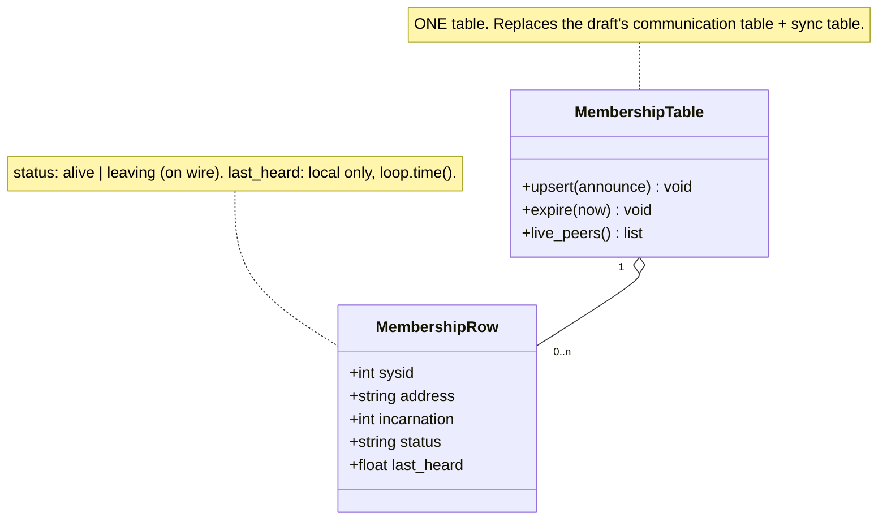
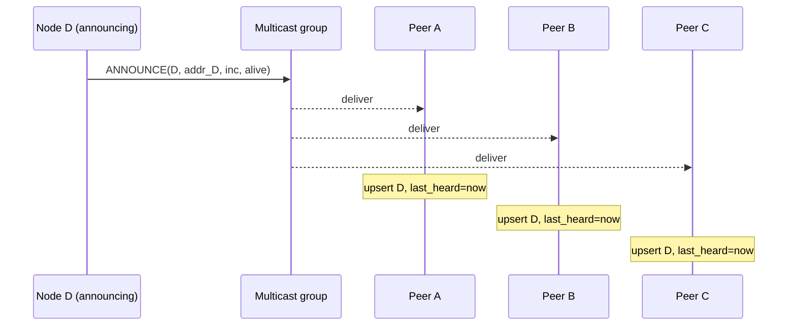
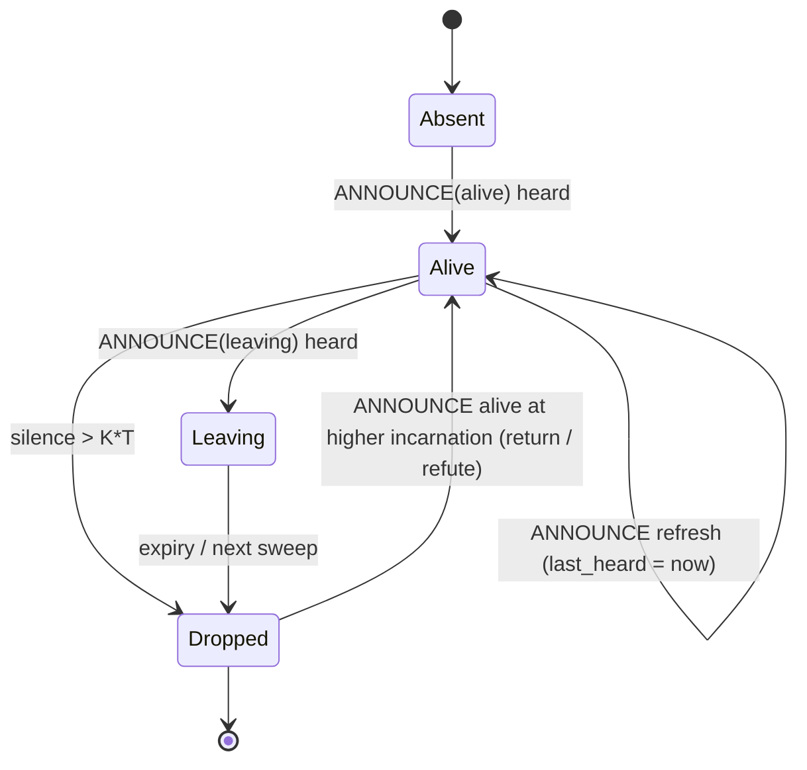
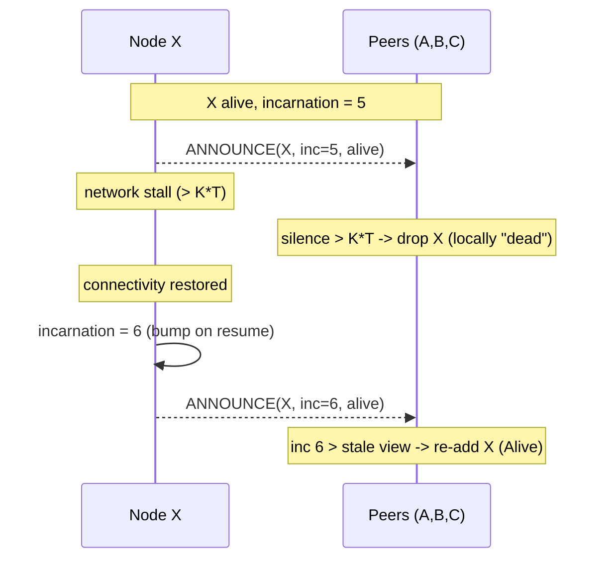
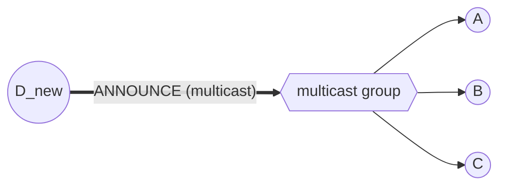
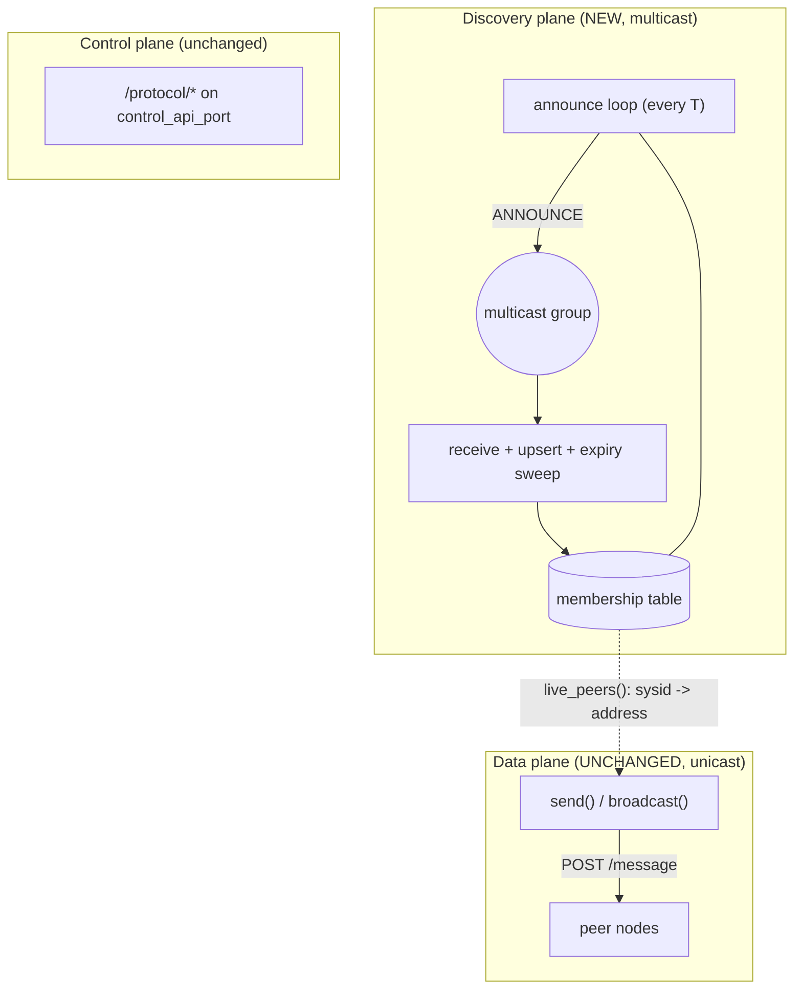

# A Soft-State Self-Announce Auto-Scout Protocol

*A multicast, soft-state membership protocol for the GrADyS-Embedded HTTP transport — and a critique of
the epidemic draft it replaces.*

This document specifies a self-discovery mechanism that lets a drone **join a swarm by periodically
announcing itself**, with no pre-shared peer list. Each node keeps a small **membership table** that is
a *cache of recently-heard announcements*: a peer is alive while its announcements keep arriving and is
forgotten when they stop. There is **one table, one message, and no modes**. The design is sized for the
real GrADyS deployment envelope — **4 to 15 drones, low rotativity (churn), a single LAN with reliable
UDP multicast** — and deliberately avoids the machinery that only pays off at hundreds of nodes.

It is a direct alternative to [`http-auto-scout-epidemic-anti-entropy.md`](./http-auto-scout-epidemic-anti-entropy.md) (the
"epidemic draft"). **Part I** is the standalone specification; **Part II** is the critique of the draft
that motivates every simplification here. The two documents are meant to be read as a matched pair.

---

# Part I — The solution

## 1. Motivation

On the GrADyS-Embedded HTTP transports (`http` / `https` / `http3`), every node must be pre-loaded with
a complete, immutable peer directory — a `node_ip_dict` mapping each `sysid` to an `ip:port`. Adding or
moving a drone means editing that directory on **every** node before launch. The zenoh transports avoid
this — they get discovery for free from Eclipse Zenoh's UDP-multicast scouting — but the HTTP transports
have no equivalent, so `auto_scout` is currently a no-op for them
(`runner/configuration.py.__post_init__` only logs a warning).

The goal is the same as the draft's: bring **self-discovery to the HTTP transport** as an
application-level layer. The difference is *how*. The draft reconciles full membership tables pairwise
and propagates changes epidemically until the swarm provably converges. This document argues that at
4–15 full-mesh-reachable nodes that machinery is unnecessary, and that a **soft-state self-announce**
loop — the pattern behind mDNS/Avahi, OLSR `HELLO` beaconing, and most LAN service discovery — delivers
the same result with a fraction of the moving parts.

---

## 2. Design principle: soft state over hard state

The single decision everything else follows from:

> **Membership is a cache of recently-heard announcements, not a replicated ledger. Liveness is
> recency.**

A node does not try to *agree* with its peers on the swarm roster, persist it, or detect when the swarm
has "converged." It simply broadcasts "I'm here" on a fixed cadence and listens for others doing the
same. Presence in the table means *"I heard from this node recently"*; absence means *"I haven't."* No
node is ever authoritative for another node's liveness — every node is authoritative only for **its
own** beacon.

This is the opposite of the draft's *hard state*, where a row, once learned, persists until an explicit
(and carefully versioned) tombstone retires it. Soft state means a lost packet costs nothing — the next
beacon repairs it — and a crashed node needs no death certificate, because its row simply ages out.

Three consequences, each developed below:

- **One message** (§5) instead of three (`NOTIFY`/`SYNC`/`LEAVE`).
- **One table** (§4) instead of two (communication + sync).
- **No modes and no termination detection** (§6) — the loop runs forever at a trivial fixed cost.

---

## 3. Scenario (operating envelope)

| Assumption | Value | Consequence |
|---|---|---|
| Fleet size | 4–15 drones | Full-mesh reachable; no need for transitive relay. |
| Churn (rotativity) | Low | Detection latency of a few seconds is fine. |
| Network | Single LAN, reliable UDP multicast | A beacon reaches every peer directly — same constraint zenoh `auto_scout` already carries. |
| Transport | HTTP family (`http`/`https`/`http3`) | Data plane stays the existing unicast `POST /message`; discovery is a *separate* multicast plane. |

**Network model.** A single LAN forming one reliable multicast domain in which every node is
**full-mesh reachable** — every beacon reaches every peer directly, so no transitive relay is needed.
This is the special case of `http-auto-scout-epidemic-anti-entropy.md`'s broader model where the swarm is
small and the graph is never partitioned; `http-auto-scout-contact-triggered-dtn.md` covers the opposite
extreme (sparse, intermittent, partition-prone).

Every simplification below is justified *by this envelope*. §16 states precisely when the envelope
breaks and the heavier epidemic design becomes the right call instead.

---

## 4. Data structure: the membership table

One table. One row per known node:

| Field | Meaning | Scope |
|---|---|---|
| `sysid` | The node's unique id (same value protocols use as `node_id`). | on the wire |
| `address` | Where to reach it for the data plane (`ip:port`). | on the wire |
| `incarnation` | A monotonic counter **owned by `sysid`**, bumped by that node to override stale views of itself (SWIM incarnation number). | on the wire |
| `status` | `alive` or `leaving`. | on the wire |
| `last_heard` | Local monotonic timestamp of the most recent announcement (`loop.time()`, the runner's clock). | **local only** |

**Arbitration.** When two views of the same `sysid` meet, the winner is the one with the larger
**(incarnation, status-rank)** pair, compared lexicographically, with

```
status-rank:  alive = 0  <  leaving = 1  <  dead = 2
```

`dead` is never sent on the wire — it exists only as the local result of expiry (§6) and as the ordering
top so a refutation (§7) is well-defined. Because exactly one node ever increments a given `sysid`'s
incarnation, ties are impossible and the rule is deterministic.

`last_heard` is the soft-state clock: it is **not** transmitted and **not** arbitrated — each node keeps
its own, refreshed on every announcement it hears for that row.



Contrast with the draft, which carries **two** tables — a communication table (who is in the swarm) and
a parallel sync table (which peers have seen my current view). The sync table exists only to drive
epidemic termination (see §14, P1); soft state has nothing to terminate, so it is gone.

---

## 5. The one message: `ANNOUNCE`

A single multicast message carries a node's own row:

```
ANNOUNCE  { sysid, address, incarnation, status }      → multicast group
```

It is sent:

- **periodically**, every `T` seconds (the heartbeat), and
- **immediately** on three events: joining (first announce), leaving (`status=leaving`), and refuting a
  stale view of oneself (incarnation bumped — see §7).

**Receipt rule** — on hearing an `ANNOUNCE` for `sysid`:

| Situation | Action |
|---|---|
| `sysid` unknown | Insert the row; set `last_heard = now`. |
| `sysid` known, incoming (incarnation, status-rank) **>** local | Adopt address/incarnation/status; set `last_heard = now`. |
| `sysid` known, incoming **==** local | Refresh `last_heard = now` (the liveness signal). |
| `sysid` known, incoming **<** local | Ignore as stale. |

That is the entire protocol logic. There is no request/response, no two-way reconciliation, no
acknowledgement, and therefore no asymmetric-failure window (contrast §14, P2). A node only ever
*states facts about itself*; it never asserts another node's state, so two announcements can never
contradict in a way that needs resolving beyond the highest-incarnation rule.



Deliberately one phase, one direction — compare the draft's two-phase `NOTIFY`→reply→`SYNC` exchange in
its §6.

---

## 6. The announce loop and soft-state expiry

Every node runs one periodic task on the runner's event loop:

```
every T seconds:
    table.upsert(my_own_row)            # refresh my last_heard locally too
    send ANNOUNCE(my_own_row)           # multicast my beacon
    now = loop.time()
    for row in table:
        if row.sysid != me and now - row.last_heard > K * T:
            drop row                    # soft-state expiry == failure detection
```

- `T` — announce interval. Default **1.0 s** (see §11).
- `K` — expiry multiple. Default **4**: a peer is forgotten after ~`K·T` = 4 s of silence, tolerating
  up to `K−1` consecutive lost beacons before a false drop.

**Bootstrap is not a special case.** A fresh node just starts the loop: its first `ANNOUNCE` makes it
known, and the announcements it hears fill its table — within one `T`. There is no `NOTIFY`/reply
handshake to lose (contrast §14, P4). An optional one-shot multicast *solicit* ("who's there?") on
startup can shorten the first fill below `T`, but it is not required for correctness.

**Graceful leave** is an `ANNOUNCE` with `status=leaving` (rank 1 > alive's rank 0 at the same
incarnation), so peers immediately rank the node as departing and expedite its removal. A node that just
powers off sends nothing and ages out after `K·T` — the same path, slightly slower.

The lifecycle of a **single row** in a peer's table:



This **per-row soft-state lifecycle is the direct replacement for the draft's node-wide
`Normal`/`Syncing` modes**. The draft's modes describe whether *this whole node* still has reconciliation
work to do; here, each row independently ages, and the node itself is always in the same steady state —
announce, listen, sweep. There is no global "converged" predicate to compute because there is nothing to
converge: the table is eventually consistent by construction, always at most `K·T` behind reality.

---

## 7. Failure detection and the refute mechanism

Failure detection is **timeout-based and falls out of §6 for free**: missing `K·T` worth of beacons ⇒
the row is dropped. No liveness probe, no `SYNC`-as-ping, no retry budget doubling as a detector
(contrast §14, P3).

The subtlety any soft-state scheme must answer: **a transient stall must not permanently evict a live
node.** If A's network hiccups for `K·T`, every peer drops A — and A must be able to *come back* cleanly,
even though peers may briefly hold a "dead" view of it. This is the classic SWIM **refute** problem, and
the `incarnation` field solves it exactly:

- A node owns its incarnation and is the only one that increments it.
- When a returning (or wrongly-suspected) node resumes announcing, it bumps its incarnation. The new
  `ANNOUNCE(alive, incarnation+1)` strictly beats any stale `(incarnation, dead)` view by the §4
  ordering, so peers re-adopt it deterministically.
- Crucially, **no node ever has to invent a tombstone version for a peer that crashed** (the draft's
  unsolved §10 problem): there are no tombstones. A crashed node's row simply expires locally; if it was
  a false alarm, the node refutes by re-announcing at a higher incarnation.



No deadlock, no permanent false positive, and the recovery costs exactly one beacon. We deliberately
**do not** adopt full SWIM indirect probing (asking *k* random peers to ping a suspect): at 4–15 nodes a
direct multicast timeout is accurate enough, and indirect probing would be over-engineering (see §14,
P3). The only cost is detection latency of `K·T` (~4 s) rather than sub-second — perfectly acceptable at
low rotativity.

---

## 8. Convergence behavior (worked example)

To make the comparison with the draft's §7 concrete, take the same scenario: a settled swarm **A, B,
C**, and a new node **D** joins. (To match the draft, suppose D's first beacon is relayed via the
group; in reality every node hears it at once.)



There is no relay wave. D multicasts one `ANNOUNCE`; A, B, and C each upsert D **in the same interval**.
Symmetrically, D learns A, B, C from *their* next beacons (≤ `T` later). The table view per node, where
`+D` means "row for D present":

| After | A | B | C | D |
|---|---|---|---|---|
| 0 — initial | `{A,B,C}` | `{A,B,C}` | `{A,B,C}` | *not joined* |
| 1 — D's first beacon (t≈0) | **`+D`** | **`+D`** | **`+D`** | `{D}` |
| 2 — within one `T` (peers beacon) | `+D` | `+D` | `+D` | **`{A,B,C,D}`** |

Convergence time is **one announce interval**, independent of swarm diameter, because every node hears
every beacon directly. Compare the draft's §7, where D's arrival ripples A→B→C across successive `SYNC`
rounds and the swarm is "converged" only once every sync table reaches all-`synced`. Here there is no
convergence *predicate* at all — the system is simply, continuously, at most `K·T` behind truth.

A node leaving (or crashing) is the mirror image: its `status=leaving` beacon (or its silence) removes
`+itself` from every peer within one interval (or `K·T` for a silent crash).

---

## 9. Integration with the runtime

Today `HttpBackend.send`/`broadcast` (`communication/http.py`) read the destination straight from
`self._configuration.node_ip_dict` — that dict *is* the de facto membership source. The change is to
make the membership table that source **when `auto_scout=True`**, leaving everything else untouched.



Touch points (additive, flag-gated — no change to the `CommunicationBackend` ABC or to protocol code):

- **`communication/http.py`** — `send(dest_node_id)` resolves `dest_node_id` against the membership
  table; `broadcast()` iterates the table's **live** rows. Delivery stays the existing per-peer unicast
  `POST /message` — the multicast plane is for *discovery only*, never for data. When `auto_scout=False`,
  both fall back to `node_ip_dict` exactly as today.
- **The announce loop** lives in a small new module under `communication/` (e.g.
  `communication/membership.py`) owning the table, the multicast socket, the periodic beacon, and the
  expiry sweep. `HttpBackend.serve()` starts it alongside the uvicorn/Hypercorn server when
  `auto_scout=True`.
- **`runner/configuration.py`** — flip the `__post_init__` warning so `auto_scout=True` is *honored* for
  the HTTP family instead of ignored. `node_ip_dict` becomes optional (seed/bootstrap only) under
  auto-scout; the node's own `address` is still taken from its `node_ip_dict[node_id]` entry (or a new
  explicit field).

Addressing is already consistent: protocols address peers by `node_id` (= `sysid`), and the table maps
`sysid → address` — only the lookup *source* changes, not the key.

---

## 10. Security considerations

Auto-scout over plain `http` is forgeable: any host on the LAN can multicast an `ANNOUNCE` and inject a
phantom row, or impersonate a peer's address. The mitigation and an inherent robustness property:

- **Run discovery over `https`/`http3` with the fleet-wide shared certificate.** The TLS plumbing
  already exists in `communication/certs.py` (used by the `https`/`http3`/`zenoh_quic` data planes); the
  same shared cert can authenticate beacons so only fleet members are trusted.
- **Soft state has no remotely-forgeable *evict* primitive.** This is a real advantage over the epidemic
  draft. There, a forged higher-version `LEAVE`/tombstone can *evict a live peer* and the lie persists
  (hard state). Here, the worst a forger achieves is a phantom row that **expires in `K·T`**, and it
  **cannot silence a real node**, which keeps re-announcing (and bumps its incarnation to refute any
  stale view of itself). Forgery is a transient nuisance, not a durable poisoning.

This is a flagged consideration appropriate for a research LAN, not a full authentication design.

---

## 11. Parameters and defaults

| Parameter | Default | Meaning / guidance |
|---|---|---|
| `T` (announce interval) | `1.0 s` | Heartbeat period. Lower = faster convergence + detection, more traffic. |
| `K` (expiry multiple) | `4` | Drop a peer after `K·T` silence. Tolerates `K−1` lost beacons. Detection latency ≈ `K·T` (~4 s). |
| multicast group / port | e.g. `239.255.42.99:7447` | Fleet-wide constant; must differ from zenoh's `224.0.0.224:7446` and the data-plane ports. |
| relation to `telemetry_interval` | independent | `telemetry_interval` (default 0.5 s) polls the local UAV API; `T` beacons membership. They share the event loop but are unrelated cadences. |

Steady-state cost at 15 nodes: each node emits 1 small datagram per `T` and receives 14 — ~15 tiny
multicast packets/second fleet-wide. Negligible.

---

# Part II — Critique of the epidemic draft

This part evaluates [`http-auto-scout-epidemic-anti-entropy.md`](./http-auto-scout-epidemic-anti-entropy.md) against established
distributed-systems practice (SWIM, epidemic/anti-entropy gossip, soft-state service discovery,
CRDT-style set reconciliation) and explains why Part I departs from it.

## 12. Verdict

The draft is well-reasoned, internally honest, and correctly identifies its own hardest problems (its §9
and §10). The core finding is that **it solves a harder problem than this deployment has.** It is an
*epidemic* protocol — engineered to make transitive, multi-hop rumor propagation *terminate* across a
large network. Almost all of its machinery exists to serve that termination goal:

- the **sync table**, which tracks which peers have seen the local view;
- the **`Normal`/`Syncing` modes** and the **all-`synced`** termination signal;
- the **§9 "SYNC transport semantics"** hazard, which arises only because two nodes must jointly agree
  an exchange completed.

At 4–15 full-mesh-reachable nodes on a reliable-multicast LAN, transitive propagation is unnecessary —
every node can hear every other directly. Remove the need to relay-and-terminate and the entire
superstructure collapses, taking its hardest bugs with it. That is exactly what Part I does.

## 13. What the draft gets right (and Part I keeps)

- **Per-`sysid` incarnation numbers, highest-wins.** This is precisely SWIM's arbitration key and it is
  sound. Part I keeps it verbatim (§4) and leans on it for the refute mechanism (§7).
- **Honesty about the hard parts.** The draft explicitly flags the SYNC asymmetric-failure stall (its
  §9) and the tombstone-versioning / refute problem (its §10) rather than hiding them. That candor is
  what makes the comparison clean.
- **Departures as first-class.** The draft treats leave/crash with the same machinery as joins. Part I
  preserves that symmetry — leaving is just an `ANNOUNCE(leaving)`, crash is silence; both are the same
  expiry path.

## 14. Problems, recommendations, trade-offs

### P1 — The sync table + modes + termination detection are over-engineered here *(draft §5, §7)*
**Problem.** Epidemic propagation (A learns → A`SYNC`s B → B`SYNC`s C…) and the all-`synced` termination
signal are designed for networks too large for O(n²) full-mesh contact. At ≤15 nodes, full mesh is ≤105
pairs — trivial — so the sync table, the two modes, and the termination logic add a multi-node state
machine that buys nothing.
**Recommendation.** Soft-state periodic self-announce (Part I): multicast your own row every `T`, upsert
on receipt, expire after `K·T`. No sync table, no modes, no termination predicate.
**Trade-offs.** *Wins:* deletes the sync table, both modes, termination detection, the §9 hazard (P2),
tombstone minting, and the refute deadlock (P3); loss-tolerant by construction. *Costs:* a few KB/s of
steady-state multicast (negligible) and push-only convergence in one `T` rather than instant — both fine
at this scale and churn.

### P2 — The SYNC asymmetric-failure stall is real but self-inflicted *(draft §9)*
**Problem.** The draft notes that if A's table reaches B but B's reply is lost, B marks A `synced` while
A keeps B `unsynced`; a node can then reach all-`synced`, drop to `Normal`, and stop propagating while a
peer still expects it — stalling the epidemic and breaking the §5–§7 convergence invariant. This is a
genuine correctness bug, born entirely of the *shared two-node post-condition* ("both mark each other
synced").
**Recommendation.** It vanishes under P1 — a beacon has no two-party post-condition to desynchronize, no
reply to lose. *If* a table-exchange variant were ever retained (Part I does not), the fix is a single
**idempotent push-pull RPC** where only the *initiator* records "reconciled" upon receiving the
response — never a shared mutual flag — so a lost response just triggers a retry.
**Trade-off.** None meaningful; P1 is strictly simpler and strictly more robust here.

### P3 — Replace "mint a tombstone version" with SWIM (incarnation, status) ordering *(draft §8, §10)*
**Problem.** The draft's open question — how a failure detector picks a tombstone version for a node
that crashed *before* bumping its own incarnation — is the classic SWIM refute problem, left unsolved.
Worse, using the `SYNC` retry budget *as* the failure detector tombstones a slow-but-alive peer.
**Recommendation.** Adopt SWIM's resolution: order by **(incarnation, status-rank)** with
`alive < suspect/leaving < dead`; a node refutes a stale view of *itself* only by incrementing its own
incarnation and re-announcing `alive` (§7). Under soft state there is no tombstone to mint at all — a
dead row simply expires, and a false positive is repaired by the owner's next (incarnation-bumped)
beacon.
**Trade-offs.** *Wins:* closes the draft's §10 open question with a textbook mechanism; no false-positive
tombstoning of slow peers; no tombstone garbage to GC. *Costs:* detection latency `K·T` (~4 s) vs.
immediate — fine at low churn. Explicitly **not** recommending full SWIM indirect probing (k-relay
pings): over-engineering at 15 nodes.

### P4 — Bootstrap / join reliability *(draft §6)*
**Problem.** The draft's `NOTIFY` is a single unsolicited multicast with no retry; lose it and the
joiner may get no reply. Convergence also presumes the joiner can reach ≥1 existing member.
**Recommendation.** Under P1, "join" *is* "start announcing" — bootstrap and steady state are the same
mechanism, repeated every `T`, so a lost beacon self-heals on the next one. An optional one-shot solicit
shortens first-fill but isn't required.
**Trade-off.** Worst-case first-fill is one `T` instead of an instant reply — immaterial at low churn.

### P5 — Integration with `node_ip_dict` and `send`/`broadcast` *(both designs)*
**Problem.** `HttpBackend.send`/`broadcast` read `node_ip_dict` directly; nothing consults a dynamic
table yet. This is the real integration seam for *either* design.
**Recommendation.** Make the membership table the runtime directory when `auto_scout=True` (§9): `send`
resolves against it, `broadcast` iterates live rows, delivery stays unicast `POST /message`;
`auto_scout=False` keeps today's behavior. Additive and flag-gated, mirroring how zenoh already treats
`auto_scout`.
**Trade-off.** A small change in `http.py` and the `configuration.py` warning; no ABC or protocol change.

### P6 — Membership poisoning over plain HTTP *(security)*
**Problem.** On plain `http`, any LAN host can inject membership. In the draft this is acute: a forged
higher-version `LEAVE`/tombstone *durably evicts* a live peer.
**Recommendation.** Run auto-scout over `https`/`http3` with the fleet-wide shared cert (`certs.py`
exists). Note the structural advantage of soft state (§10): no forgeable durable evict — a forged row
just expires and cannot silence a re-announcing node.
**Trade-off.** A flagged consideration, not a full authn design — appropriate for a research LAN.

### P7 — When the epidemic draft *would* be the right call
The drafted event-driven epidemic/anti-entropy design is the correct tool when the envelope of §3
breaks:
- **Hundreds-plus nodes**, where O(n²) full-mesh contact and per-beacon multicast fan-out stop being
  free and transitive propagation genuinely pays off (cf. HashiCorp Serf/memberlist, Demers et al.
  push-pull anti-entropy).
- **Multicast unavailable or partitioned**, where discovery must travel unicast and transitively — a
  beacon can't reach everyone directly, so relay-and-converge is required.
And if a team simply wants discovery without hand-rolling *any* of this, `zenoh_tcp`/`zenoh_quic` with
`auto_scout=True` already provides it. The HTTP auto-scout layer — in either form — earns its keep only
when staying on the HTTP transport is a hard requirement.

## 15. Mapping to known systems

| Draft mechanism | Closest established system | Verdict at 4–15 nodes |
|---|---|---|
| Per-`sysid` incarnation, highest-wins | SWIM incarnation numbers | **Keep** — sound; Part I §4/§7 reuse it |
| Communication table (LWW per `sysid`) | LWW-element-set CRDT | Keep, simplified to a single (incarnation, status) key |
| Sync table + `Normal`/`Syncing` + all-`synced` termination | Epidemic anti-entropy termination | **Drop** — over-engineered (P1) |
| `SYNC` push-pull table exchange | Demers push-pull anti-entropy / Serf | **Drop** for periodic self-announce (P1, P2) |
| `NOTIFY` join multicast | mDNS/Avahi announce, SWIM join | **Fold** into the periodic announce (P4) |
| `LEAVE` + tombstone version minting | SWIM dead + refute (unsolved in draft) | **Replace** with (incarnation, status) + soft-state expiry (P3) |
| Crash detection via SYNC retry budget | SWIM failure detector | **Replace** with timeout on missed beacons (P3) |
| Multicast availability assumption | Same as zenoh scouting / mDNS | **Keep** (envelope assumes reliable multicast) |

## 16. Summary

For 4–15 drones with low rotativity on a reliable-multicast LAN, **soft-state self-announce** delivers
the same outcome as the epidemic draft — runtime self-discovery with no hand-maintained peer list — with
one table, one message, no modes, and no unsolved problems. It keeps the draft's one genuinely good idea
(per-`sysid` incarnation numbers) and discards the rest as machinery for a scale this deployment does not
operate at. Should the fleet grow into the hundreds or lose reliable multicast, revisit the epidemic
design (or Zenoh) per P7.

---

## 17. Bibliography

The established work this design draws on (the formal companion to the §15 mapping table):

- **SWIM** — A. Das, I. Gupta, A. Motivala, "SWIM: Scalable Weakly-consistent Infection-style Process
  Group Membership Protocol", *Proc. DSN '02*, IEEE/IFIP, pp. 303–312, 2002.
  DOI: [10.1109/DSN.2002.1028914](https://doi.org/10.1109/DSN.2002.1028914). — the per-`sysid` incarnation
  numbers and the self-refute mechanism kept verbatim (§4, §7).
- **mDNS** — S. Cheshire, M. Krochmal (Apple), "Multicast DNS", IETF
  [RFC 6762](https://www.rfc-editor.org/rfc/rfc6762.html), 2013. — the periodic multicast self-announce /
  soft-state service-discovery pattern (also Apple Bonjour, Avahi) that `ANNOUNCE` + `K·T` expiry
  implements (§5, §6).
- **DNS-SD** — S. Cheshire, M. Krochmal (Apple), "DNS-Based Service Discovery", IETF
  [RFC 6763](https://www.rfc-editor.org/rfc/rfc6763.html), 2013. — the companion convention for
  enumerating named service/member instances over mDNS.
- **OLSR** — T. Clausen, P. Jacquet (eds.), "Optimized Link State Routing Protocol (OLSR)", IETF
  [RFC 3626](https://www.rfc-editor.org/rfc/rfc3626.html), 2003. — the periodic `HELLO` beaconing model
  the announce loop echoes (§6).
- **Anti-entropy / epidemic gossip** — A. Demers et al., "Epidemic Algorithms for Replicated Database
  Maintenance", *Proc. PODC '87*, pp. 1–12, 1987.
  DOI: [10.1145/41840.41841](https://doi.org/10.1145/41840.41841). — the push-pull `SYNC` reconciliation
  this design deliberately *drops* as over-engineered at this scale (§14, P1–P2).
- **CRDTs** — M. Shapiro, N. Preguiça, C. Baquero, M. Zawirski, "Conflict-free Replicated Data Types",
  *SSS 2011*, LNCS 6976, Springer, pp. 386–400, 2011.
  DOI: [10.1007/978-3-642-24550-3_29](https://doi.org/10.1007/978-3-642-24550-3_29). — the LWW-element-set
  framing of the membership table's `(incarnation, status)` arbitration (§4).
- **Serf / memberlist** — HashiCorp, "memberlist: gossip-based membership and failure detection"
  (open-source), 2013–present. [github.com/hashicorp/memberlist](https://github.com/hashicorp/memberlist)
  ([serf.io](https://www.serf.io/)). — the production SWIM-derived system to reach for if the fleet outgrows
  this envelope (§14, P7).
